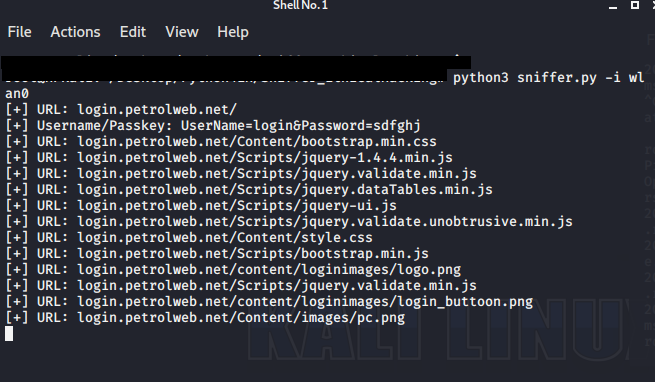

# Packet Sniffer
Using scapy to sniff packets on an interface. The following implementation has filters that capture usernames and URL's. Run this program with an ARPSpoofing program to capture URLs and login combinations from target computers. 
## Getting Started
Download the repository and run the program using:
> Python == 3.7.5
>
> Scapy == 2.4.3
>
## Details
| File | Information |
|-------|------------|
| output.png  | program output  | 
| sniffer.py  | main program | 
| venv  | python environment  | 
## Output

